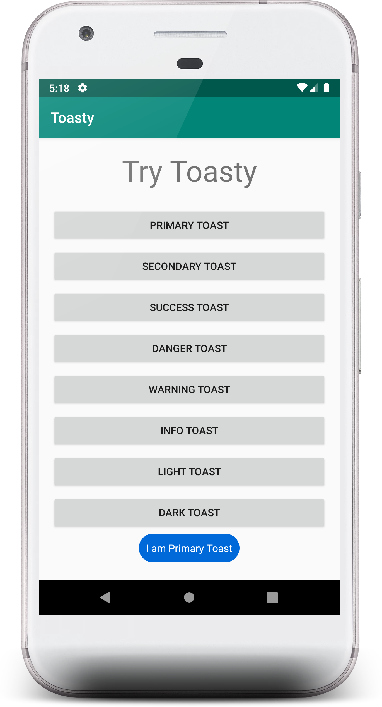

# Toasty - Bootstrap Style Toasts
A new way to create toasts, similar like Bootstrap alerts.

[](https://jitpack.io/#pprathameshmore/Toasty) [](https://opensource.org/licenses/MIT)  [](https://GitHub.com/pprathameshmore/Toasty) [](https://snyk.io/test/github/pprathameshmore/Toasty)

## Sample Screenshot:





## Installation:


In order to use it, you need to include it in your project

#### Gradle:
```groovy
allprojects {
    repositories {
      ...
      maven { url 'https://jitpack.io' }
    }
}
```
```groovy
dependencies {
     implementation 'com.github.pprathameshmore:Toasty:053e70ac24'
}
```
## Usages:


1. Create instance of `Toasty` class
```java
     final Toasty toasty = new Toasty(MainActivity.this);

        Button btnPrimary = findViewById(R.id.btn_primary);

        btnPrimary.setOnClickListener(new View.OnClickListener() {
            @Override
            public void onClick(View v) {
                toasty.primaryToasty(MainActivity.this,"I am Primary Toast", Toast.LENGTH_LONG);
            }
        });
```
2. Toasty provides many other methods to implement different types of Toasts.
3. All Toasty methods takes same parameters as given below
    ```java
   Toasty toasty = new Toasty(Context contex);
    toasty.secondaryToasty(Context context, String text, int duration);
    infoToasty();
   lightToasty();
   darkToasty();
   successToasty();
   dangerToasty();
   warningToasty();  
    ```
1. Refer Bootstrap alerts
  https://getbootstrap.com/docs/4.3/components/alerts/ 

## License (MIT):


```
The MIT License (MIT)
=====================

Copyright © 2019 Prathamesh More

Permission is hereby granted, free of charge, to any person
obtaining a copy of this software and associated documentation
files (the “Software”), to deal in the Software without
restriction, including without limitation the rights to use,
copy, modify, merge, publish, distribute, sublicense, and/or sell
copies of the Software, and to permit persons to whom the
Software is furnished to do so, subject to the following
conditions:

The above copyright notice and this permission notice shall be
included in all copies or substantial portions of the Software.

THE SOFTWARE IS PROVIDED “AS IS”, WITHOUT WARRANTY OF ANY KIND,
EXPRESS OR IMPLIED, INCLUDING BUT NOT LIMITED TO THE WARRANTIES
OF MERCHANTABILITY, FITNESS FOR A PARTICULAR PURPOSE AND
NONINFRINGEMENT. IN NO EVENT SHALL THE AUTHORS OR COPYRIGHT
HOLDERS BE LIABLE FOR ANY CLAIM, DAMAGES OR OTHER LIABILITY,
WHETHER IN AN ACTION OF CONTRACT, TORT OR OTHERWISE, ARISING
FROM, OUT OF OR IN CONNECTION WITH THE SOFTWARE OR THE USE OR
OTHER DEALINGS IN THE SOFTWARE.
```


